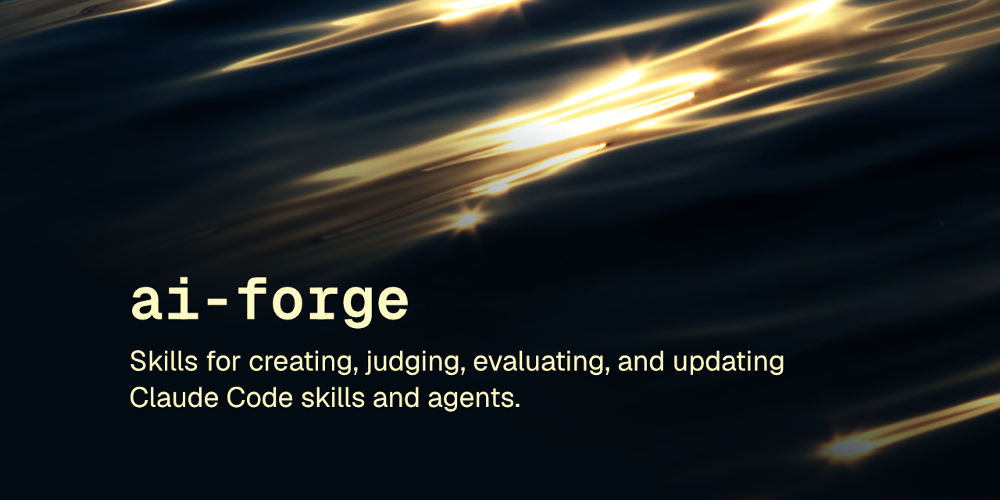

<p align="center"></p>

# ai-forge

8 skills build & grade Claude Code skills/agents. Create, judge, eval, ship.

[](LICENSE) [](https://skills.sh/robcsaszar/ai-forge)

Eight skills covering the full lifecycle of an AI skill or agent definition: create it, judge it, review it before it ships, apply approved findings, evaluate it behaviorally, recap what it actually does versus what it claims, update it, and audit a whole repo of them at once.

These skills follow the [Agent Skills specification](https://agentskills.io/specification) so they can be used by any skills-compatible agent.

## Installation

### npx skills

```
npx skills add robcsaszar/ai-forge
```

### Marketplace

```
/plugin marketplace add robcsaszar/ai-forge
/plugin install robcsaszar-ai-forge@ai-forge
```

### Manually

Copy the `skills/` directory into your project's `.claude/skills/`.

## Installing a single skill

```
npx skills add robcsaszar/ai-forge --skill ai-forge-judge
```

Or manually, copy just that skill's directory:

```sh
cp -r skills/ai-forge-judge /path/to/project/.claude/skills/
```

## Skills

| Skill | Description |
|-------|-------------|
| [ai-forge-apply](skills/ai-forge-apply) | HITL application of a numbered list one item at a time: status board upfront, per-item approve/skip, commits after each approved item |
| [ai-forge-audit](skills/ai-forge-audit) | Batch-evaluates every skill and agent in a repo with ai-forge-judge and renders one consolidated grade report, worst first |
| [ai-forge-create](skills/ai-forge-create) | Creates a new skill, agent definition, or instruction file via discovery recap, pattern selection, and a judge + apply quality gate |
| [ai-forge-eval](skills/ai-forge-eval) | Behavioral eval for skills and agents: parallel with-artifact vs baseline runs, assertion grading, blind A/B comparison, and optional benchmark trend tracking |
| [ai-forge-judge](skills/ai-forge-judge) | Evaluates any LLM prompt for quality: grouped dimensional scoring, letter grade, and a step-through-ready improvements list |
| [ai-forge-recap](skills/ai-forge-recap) | Reads a skill or agent's actual body and reports what it really does versus what its description claims |
| [ai-forge-review](skills/ai-forge-review) | Critically stress-tests an agent, skill, or AI workflow definition before it ships |
| [ai-forge-update](skills/ai-forge-update) | Updates an existing skill or agent: structured recap, drift detection, change elicitation, and a post-change quality gate |

## Safety

`ai-forge-create`, `ai-forge-audit`, and `ai-forge-eval` ship small helper scripts. Read [SAFETY.md](SAFETY.md) for what each does.

## License

[MIT](LICENSE) © Rob Csaszar
